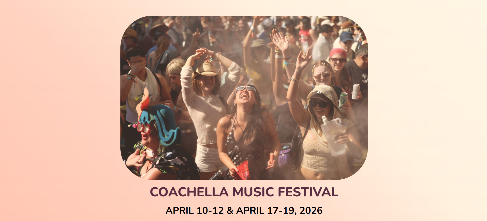

# 📁 Event Flyer Page

## ℹ️ Event Flyer Page — A Stylish Layout for Festival Promotions

A visually engaging flyer-style webpage that showcases the features and atmosphere of the Coachella Music Festival. Designed using only HTML and CSS, this page highlights key festival activities with large images, bold headings, and custom section styles.

It was built entirely with HTML and CSS as part of the [**freeCodeCamp.org**](https://www.freecodecamp.org/learn/full-stack-developer/) CSS course.

---

## 🔍 Overview

This project features a multi-section layout promoting five main activities at the Coachella Music Festival: the Activities Tent, Breaking Bread, Camping Lounge, Coachella Art Studios, and the Coachella Store.

The layout emphasizes user engagement through well-structured content blocks, consistent visual hierarchy, styled background gradients, and accessible semantic HTML elements. Each section includes an image and description to replicate a realistic festival promotional page.

---

## ✨ Features

- Fully responsive layout with fluid units and clamp-based font sizing
- Styled with semantic and accessible HTML structure
- Custom CSS gradient background for enhanced visual appeal
- Large header banner with hover effect
- Shadowed image cards with custom border-radius
- Clean section layout using box shadows and background highlights
- Themed color palette inspired by festival aesthetics
- Emphasized typography and section titles
- Decorative separators (`
`) between content areas

---

## 🧠 What I Learned

- Designing modern, image-driven landing pages with just HTML and CSS
- Using `clamp()` and `min-width` effectively for responsive typography and layout control
- Creating custom color gradients and layered background effects
- Applying consistent padding, margin, and border logic across sections
- Implementing hover effects and opacity transitions for better UI experience
- Structuring large HTML documents using semantic and maintainable sectioning

---

## 🛠️ Tech Used

- HTML5
- CSS3

---

## 🚀 How to Run

1. Clone the repository
2. Navigate to this project folder
3. Open `index.html` in your browser

---

## 🌐 Live Demo

Or you can check out the 👉 [live website here](https://html-css-daily.netlify.app/build%20an%20event%20flyer%20page/)

---

## 🧑‍💻 Author

Created by **Elmar Chavez**

🗓️ Month/Year: **May 2025**

📚 Journey: **2nd** month of learning _frontend web development_.
